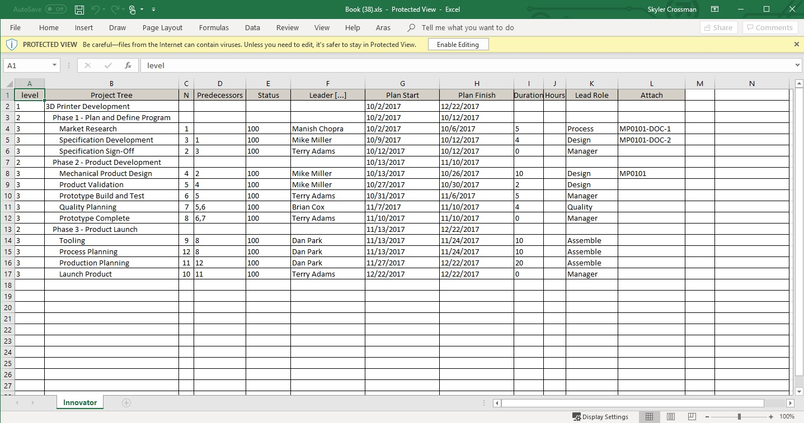

# Project Plan Excel Export

The Project Plan tree view is non-standard enough that the normal export to excel functionality wouldn't work. As such, this project has been made to format the data in such a way as to make use of Aras Innovator's export functionality.

## Project Details

Release | Notes
--------|--------
[v1.0](https://github.com/ArasLabs/project-plan-excel-export/releases/tag/v1.0) | First release. Built and tested on Aras Innovator 12 SP1.

#### Supported Aras Versions

Project | Aras
--------|------
[v1.0](https://github.com/ArasLabs/project-plan-excel-export/releases/tag/v1.0) | 12.0 SP1

## Installation

#### Important!
**Always back up your code tree and database before applying an import package or code tree patch!**

### Pre-requisites

1. Aras Innovator installed, preferably version 12 SP 1

### Install Steps

1. Backup your code tree and store the archive in a safe place
2. Navigate to your local `..\ExportProjectPlanToExcel\` folder
3. Copy the `\Innovator\` folder
4. Paste this at the root of your install directory
+ By default this is `C:\Program Files\Aras\Innovator\`

## Usage

1. Login to Aras
2. Navigate to **Portfolio > Projects** in the table of contents (TOC) and click Search
3. Right click on a Project item in the main grid and select **Open**
4. Left click the Expand All button  in the tree grid toolbar
5. Left click the Export to Excel button  in the tree grid toolbar
6. A download will begin in your browser with the excel file. 

When done, your file will look something like this:

Note: At present, custom grid layouts are not supported by this project.

## Contributing

1. Fork it!
2. Create your feature branch: `git checkout -b my-new-feature`
3. Commit your changes: `git commit -am 'Add some feature'`
4. Push to the branch: `git push origin my-new-feature`
5. Submit a pull request

For more information on contributing to this project, another Aras Labs project, or any Aras Community project, shoot us an email at araslabs@aras.com.

## Credits

Original Aras community project written by Skyler Crossman at Aras Corp.

Documented and published by Skyler Crossman for Aras Labs. @skycrossman

## License

This project is published to Github under the MIT license. See the [LICENSE file](./LICENSE.md) for license rights and limitations.